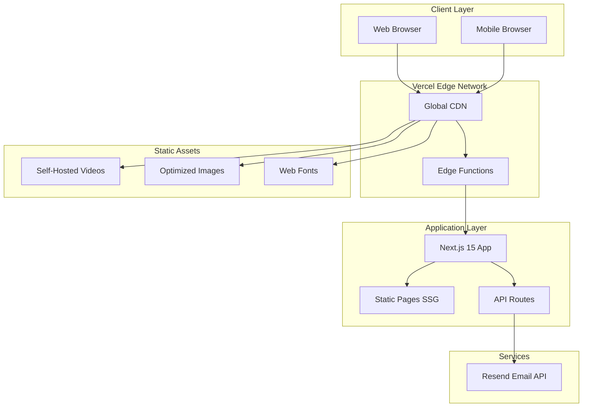
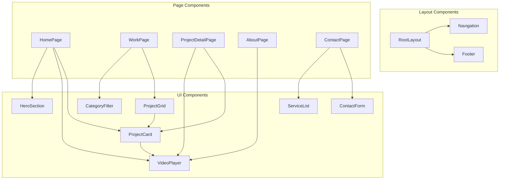
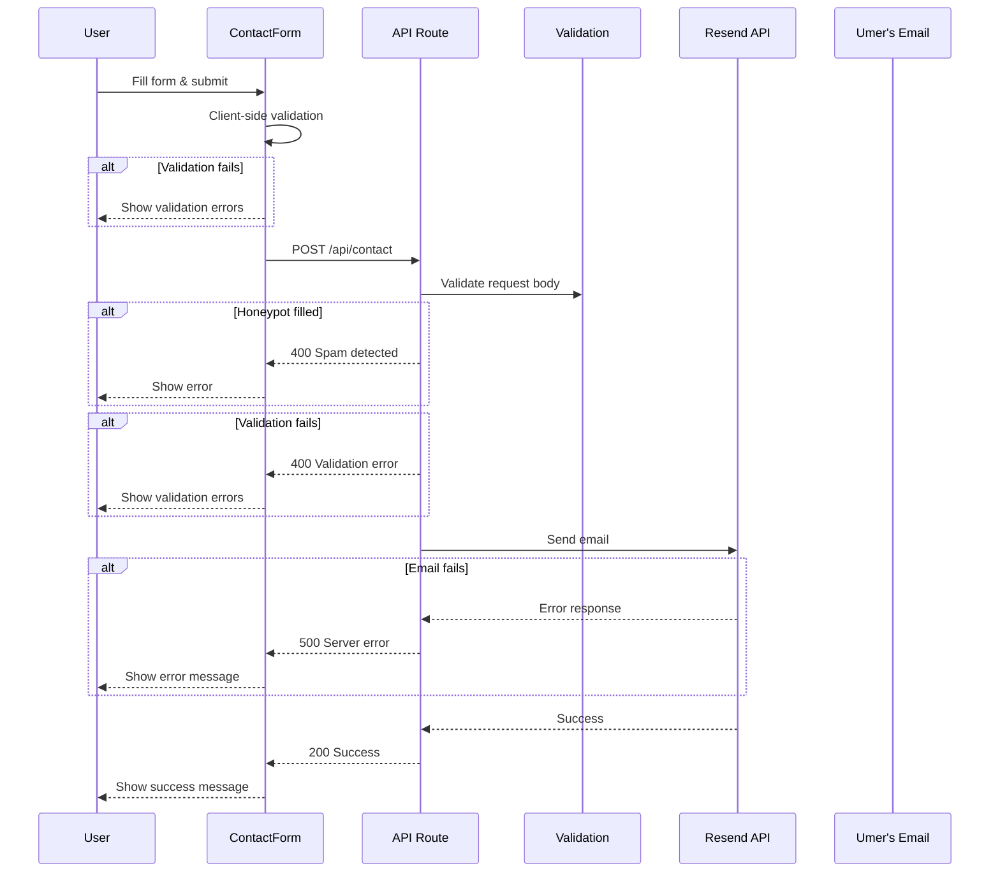
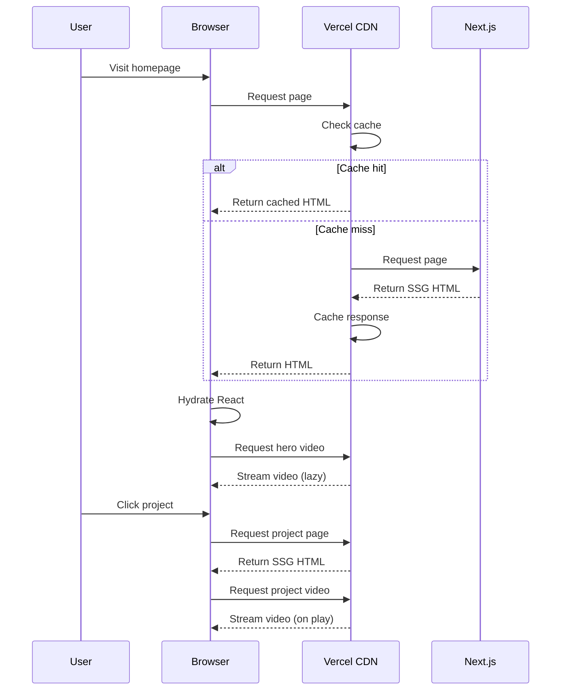
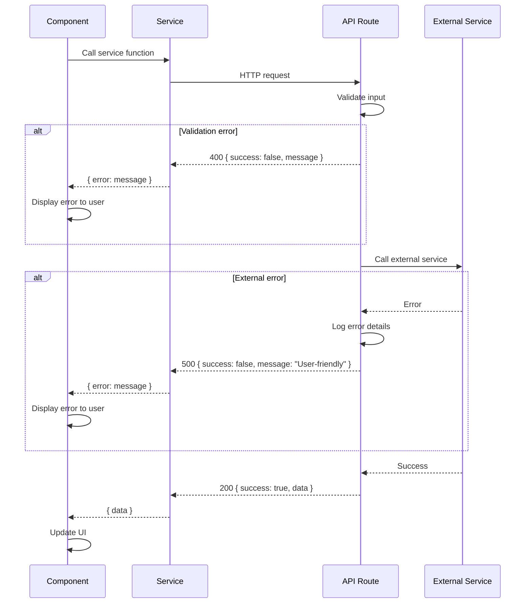

# UmerFilms Portfolio - Full-Stack Architecture Document

---

## Introduction

This document outlines the complete fullstack architecture for UmerFilms Portfolio, including frontend implementation, API routes, and deployment infrastructure. It serves as the single source of truth for AI-driven development, ensuring consistency across the entire technology stack.

This is a JAMstack architecture optimized for a video-first portfolio website. The design prioritizes performance (video delivery), developer experience (Next.js App Router), and simplicity (no database for MVP).

### Starter Template or Existing Project

**Status:** Existing Next.js 15 project (already initialized)

The project was bootstrapped with `create-next-app` and includes:
- Next.js 15 with App Router
- TypeScript configured
- Tailwind CSS configured
- ESLint configured

**Constraints from existing setup:**
- Must use App Router (not Pages Router)
- TypeScript strict mode expected
- Tailwind for styling (no CSS-in-JS)

### Change Log

| Date | Version | Description | Author |
|------|---------|-------------|--------|
| 2025-12-09 | 0.1 | Initial architecture document | Architect (Winston) |

---

## High Level Architecture

### Technical Summary

UmerFilms is a JAMstack portfolio application built with Next.js 15 using the App Router for optimal performance and SEO. The architecture leverages static site generation (SSG) for all portfolio pages, with a single serverless API route handling contact form submissions via Resend email service. Self-hosted videos are served through Vercel's Edge Network with lazy loading and progressive enhancement. The entire application deploys as a single unit to Vercel, providing automatic CI/CD, edge caching, and global CDN distribution. This architecture achieves the PRD goals of sub-3-second load times, video-first experience, and seamless client inquiry capture.

### Platform and Infrastructure Choice

**Platform:** Vercel

**Key Services:**
- Vercel Edge Network (CDN, static hosting)
- Vercel Serverless Functions (API routes)
- Vercel Analytics (performance monitoring)
- Resend (transactional email)

**Deployment Region:** Auto (Vercel's global edge network)

**Rationale:**
- Vercel is purpose-built for Next.js - zero configuration deployment
- Edge Network provides optimal video delivery performance
- Serverless functions handle contact form without managing servers
- Free tier covers MVP requirements
- Built-in analytics for tracking Core Web Vitals

### Repository Structure

**Structure:** Monorepo (single Next.js application)

**Monorepo Tool:** N/A - Single app, npm workspaces not needed for MVP

**Package Organization:** Standard Next.js App Router structure

**Rationale:**
- Portfolio is a single application with no separate services
- Keeps deployment simple - one repo, one deploy
- Shared types/utilities live within the app structure

### High Level Architecture Diagram



### Architectural Patterns

- **JAMstack Architecture:** Pre-rendered static pages with serverless API for dynamic functionality - _Rationale:_ Maximum performance for portfolio browsing, minimal infrastructure costs, excellent SEO

- **Component-Based UI:** Reusable React components with TypeScript - _Rationale:_ Maintainability, type safety, consistent design system across pages

- **Static Site Generation (SSG):** All pages pre-rendered at build time - _Rationale:_ Fastest possible page loads, optimal Core Web Vitals, CDN-cacheable

- **Serverless Functions:** API routes for contact form processing - _Rationale:_ No server management, scales to zero when unused, cost-effective

- **Progressive Enhancement:** Core content accessible without JavaScript, enhanced with interactivity - _Rationale:_ SEO benefits, accessibility, faster perceived performance

- **Service Layer Pattern:** Centralized API communication through service modules - _Rationale:_ Separation of concerns, easier testing, consistent error handling

---

## Tech Stack

### Technology Stack Table

| Category | Technology | Version | Purpose | Rationale |
|----------|------------|---------|---------|-----------|
| Frontend Language | TypeScript | 5.x | Type-safe development | Catches errors at compile time, better DX |
| Frontend Framework | Next.js | 15.x | React framework with SSG/SSR | Best-in-class for performance, SEO, DX |
| UI Component Library | Custom + Tailwind | - | UI components | No external dependency, full control |
| State Management | React useState/useReducer | Built-in | Local component state | Simple app, no complex global state needed |
| Backend Language | TypeScript | 5.x | API route development | Shared types with frontend |
| Backend Framework | Next.js API Routes | 15.x | Serverless API endpoints | Integrated with frontend, zero config |
| API Style | REST | - | Contact form endpoint | Simple, single endpoint, REST is sufficient |
| Database | None (Static JSON) | - | Project data storage | MVP doesn't need dynamic data |
| Cache | Vercel Edge Cache | - | Static asset caching | Built into platform, zero config |
| File Storage | Vercel Blob / Public folder | - | Video and image hosting | Self-hosted per requirements |
| Authentication | None | - | N/A for MVP | No user accounts required |
| Frontend Testing | Vitest + Testing Library | Latest | Component and hook testing | Fast, modern, React-focused |
| Backend Testing | Vitest | Latest | API route testing | Consistent tooling with frontend |
| E2E Testing | Playwright | Latest | Critical path testing | Best cross-browser support |
| Build Tool | Next.js CLI | 15.x | Build and dev server | Integrated, optimized for Next.js |
| Bundler | Turbopack | Built-in | Development bundling | Faster than Webpack, Next.js default |
| IaC Tool | N/A | - | Not needed | Vercel handles infrastructure |
| CI/CD | Vercel + GitHub Actions | - | Automated deployment | Zero-config with Vercel |
| Monitoring | Vercel Analytics | - | Performance monitoring | Built-in, tracks Core Web Vitals |
| Logging | Console + Vercel Logs | - | Error and debug logging | Sufficient for MVP |
| CSS Framework | Tailwind CSS | 3.x | Utility-first styling | Rapid development, consistent design |

---

## Data Models

### Project Model

**Purpose:** Represents a portfolio project/work item displayed on the Work page

**Key Attributes:**
- id: string - Unique identifier
- title: string - Project display name
- slug: string - URL-friendly identifier
- category: Category - Project category for filtering
- description: string - Project description
- thumbnailUrl: string - Path to thumbnail image
- videoUrl: string - Path to project video
- featured: boolean - Whether to show on homepage
- order: number - Sort priority

#### TypeScript Interface

```typescript
// types/project.ts

export type Category =
  | 'Commercial'
  | 'Music Video'
  | 'Wedding'
  | 'Short Film'
  | 'Personal';

export interface Project {
  id: string;
  title: string;
  slug: string;
  category: Category;
  description: string;
  thumbnailUrl: string;
  videoUrl: string;
  featured: boolean;
  order: number;
  // Optional fields for future expansion
  client?: string;
  date?: string;
  tags?: string[];
}
```

#### Relationships

- Projects are standalone entities (no relationships for MVP)
- Category is a simple enum, not a separate entity

---

### Contact Submission Model

**Purpose:** Represents a contact form submission sent to Umer

**Key Attributes:**
- name: string - Sender's name
- email: string - Sender's email address
- projectType: ProjectType - Type of project inquiry
- message: string - Inquiry message
- timestamp: string - Submission timestamp
- honeypot: string - Spam detection field (should be empty)

#### TypeScript Interface

```typescript
// types/contact.ts

export type ProjectType =
  | 'Commercial'
  | 'Music Video'
  | 'Wedding'
  | 'Short Film'
  | 'Other';

export interface ContactSubmission {
  name: string;
  email: string;
  projectType: ProjectType;
  message: string;
  honeypot?: string; // Spam detection - must be empty
}

export interface ContactResponse {
  success: boolean;
  message: string;
  error?: string;
}
```

#### Relationships

- Contact submissions are sent via email, not stored in database

---

### Site Content Model

**Purpose:** Static content for pages (about bio, services, etc.)

#### TypeScript Interface

```typescript
// types/content.ts

export interface Service {
  id: string;
  title: string;
  description: string;
  icon?: string;
}

export interface SocialLink {
  platform: 'instagram' | 'youtube' | 'tiktok';
  url: string;
  label: string;
}

export interface SiteContent {
  hero: {
    title: string;
    tagline: string;
    showreelUrl: string;
    posterUrl: string;
  };
  about: {
    videoUrl: string;
    posterUrl: string;
    bio: string[];
    skills?: string[];
  };
  services: Service[];
  social: SocialLink[];
}
```

---

## API Specification

### REST API Specification

```yaml
openapi: 3.0.0
info:
  title: UmerFilms Portfolio API
  version: 1.0.0
  description: API for UmerFilms portfolio contact form

servers:
  - url: /api
    description: Relative API path

paths:
  /contact:
    post:
      summary: Submit contact form
      description: Sends an inquiry email to Umer
      requestBody:
        required: true
        content:
          application/json:
            schema:
              $ref: '#/components/schemas/ContactSubmission'
      responses:
        '200':
          description: Email sent successfully
          content:
            application/json:
              schema:
                $ref: '#/components/schemas/ContactResponse'
        '400':
          description: Validation error
          content:
            application/json:
              schema:
                $ref: '#/components/schemas/ContactResponse'
        '500':
          description: Server error
          content:
            application/json:
              schema:
                $ref: '#/components/schemas/ContactResponse'

components:
  schemas:
    ContactSubmission:
      type: object
      required:
        - name
        - email
        - projectType
        - message
      properties:
        name:
          type: string
          minLength: 1
          maxLength: 100
        email:
          type: string
          format: email
        projectType:
          type: string
          enum: [Commercial, Music Video, Wedding, Short Film, Other]
        message:
          type: string
          minLength: 10
          maxLength: 2000
        honeypot:
          type: string
          description: Spam detection field - must be empty

    ContactResponse:
      type: object
      properties:
        success:
          type: boolean
        message:
          type: string
        error:
          type: string
```

---

## Components

### VideoPlayer Component

**Responsibility:** Reusable video player with lazy loading, autoplay support, and optimization features

**Key Interfaces:**
- `src: string` - Video source URL
- `poster?: string` - Poster image URL
- `autoplay?: boolean` - Enable autoplay (muted)
- `loop?: boolean` - Enable looping
- `onPlay?: () => void` - Play callback
- `onError?: (error: Error) => void` - Error callback

**Dependencies:** None (vanilla React)

**Technology Stack:** React component with HTML5 video API, Intersection Observer for lazy loading

---

### ProjectCard Component

**Responsibility:** Displays project thumbnail with hover preview and navigation to detail page

**Key Interfaces:**
- `project: Project` - Project data
- `priority?: boolean` - Image loading priority
- `showPreview?: boolean` - Enable hover video preview

**Dependencies:** VideoPlayer (for hover preview), Next.js Link, Next.js Image

**Technology Stack:** React component with CSS transitions for hover effects

---

### ContactForm Component

**Responsibility:** Handles contact form UI, validation, and submission

**Key Interfaces:**
- `onSuccess?: () => void` - Success callback
- `onError?: (error: string) => void` - Error callback

**Dependencies:** Contact API service

**Technology Stack:** React Hook Form (optional) or controlled components, fetch API

---

### Navigation Component

**Responsibility:** Site header with navigation links and mobile menu

**Key Interfaces:**
- N/A (uses Next.js routing internally)

**Dependencies:** Next.js Link, usePathname hook

**Technology Stack:** React component with useState for mobile menu toggle

---

### Footer Component

**Responsibility:** Site footer with social links and copyright

**Key Interfaces:**
- `socialLinks: SocialLink[]` - Social media links

**Dependencies:** None

**Technology Stack:** React component

---

### Component Diagrams



---

## External APIs

### Resend Email API

- **Purpose:** Send contact form submissions as email notifications
- **Documentation:** https://resend.com/docs
- **Base URL(s):** https://api.resend.com
- **Authentication:** API Key (Bearer token)
- **Rate Limits:** 100 emails/day (free tier), 3000/month

**Key Endpoints Used:**
- `POST /emails` - Send an email

**Integration Notes:**
- API key stored in `RESEND_API_KEY` environment variable
- Use SDK: `npm install resend`
- Sender domain must be verified or use onboarding domain

---

## Core Workflows

### Contact Form Submission Flow



### Portfolio Browsing Flow



---

## Database Schema

**N/A for MVP** - Project data is stored in static TypeScript/JSON files.

### Static Data File Structure

```typescript
// data/projects.ts

import { Project } from '@/types/project';

export const projects: Project[] = [
  {
    id: '1',
    title: 'Brand Campaign - Nike',
    slug: 'nike-brand-campaign',
    category: 'Commercial',
    description: 'High-energy commercial showcasing athletic performance...',
    thumbnailUrl: '/videos/thumbnails/nike-thumb.jpg',
    videoUrl: '/videos/projects/nike-campaign.mp4',
    featured: true,
    order: 1,
  },
  // ... more projects
];

// Helper functions
export function getAllProjects(): Project[] {
  return [...projects].sort((a, b) => a.order - b.order);
}

export function getProjectBySlug(slug: string): Project | undefined {
  return projects.find(p => p.slug === slug);
}

export function getFeaturedProjects(): Project[] {
  return projects.filter(p => p.featured).sort((a, b) => a.order - b.order);
}

export function getProjectsByCategory(category: string): Project[] {
  if (category === 'All') return getAllProjects();
  return projects.filter(p => p.category === category);
}

export function getAllCategories(): string[] {
  return ['All', ...new Set(projects.map(p => p.category))];
}
```

---

## Frontend Architecture

### Component Architecture

#### Component Organization

```
src/
├── components/
│   ├── ui/                    # Base UI components
│   │   ├── Button.tsx
│   │   ├── Input.tsx
│   │   ├── Select.tsx
│   │   ├── Textarea.tsx
│   │   └── index.ts
│   ├── layout/                # Layout components
│   │   ├── Navigation.tsx
│   │   ├── Footer.tsx
│   │   ├── PageWrapper.tsx
│   │   └── index.ts
│   ├── video/                 # Video-related components
│   │   ├── VideoPlayer.tsx
│   │   ├── HeroVideo.tsx
│   │   └── index.ts
│   ├── portfolio/             # Portfolio components
│   │   ├── ProjectCard.tsx
│   │   ├── ProjectGrid.tsx
│   │   ├── CategoryFilter.tsx
│   │   ├── RelatedProjects.tsx
│   │   └── index.ts
│   ├── contact/               # Contact components
│   │   ├── ContactForm.tsx
│   │   ├── ServiceList.tsx
│   │   └── index.ts
│   └── home/                  # Homepage components
│       ├── HeroSection.tsx
│       ├── IntroSection.tsx
│       ├── FeaturedWork.tsx
│       ├── CTASection.tsx
│       └── index.ts
```

#### Component Template

```typescript
// components/ui/Button.tsx

import { ButtonHTMLAttributes, forwardRef } from 'react';
import { cn } from '@/lib/utils';

interface ButtonProps extends ButtonHTMLAttributes<HTMLButtonElement> {
  variant?: 'primary' | 'secondary' | 'ghost';
  size?: 'sm' | 'md' | 'lg';
  isLoading?: boolean;
}

export const Button = forwardRef<HTMLButtonElement, ButtonProps>(
  ({ className, variant = 'primary', size = 'md', isLoading, children, disabled, ...props }, ref) => {
    return (
      <button
        ref={ref}
        className={cn(
          'inline-flex items-center justify-center font-medium transition-colors',
          'focus-visible:outline-none focus-visible:ring-2 focus-visible:ring-offset-2',
          'disabled:pointer-events-none disabled:opacity-50',
          {
            'bg-white text-black hover:bg-gray-200': variant === 'primary',
            'bg-transparent border border-white text-white hover:bg-white/10': variant === 'secondary',
            'bg-transparent text-white hover:bg-white/10': variant === 'ghost',
            'h-8 px-3 text-sm': size === 'sm',
            'h-10 px-4 text-base': size === 'md',
            'h-12 px-6 text-lg': size === 'lg',
          },
          className
        )}
        disabled={disabled || isLoading}
        {...props}
      >
        {isLoading ? (
          <span className="mr-2 h-4 w-4 animate-spin rounded-full border-2 border-current border-t-transparent" />
        ) : null}
        {children}
      </button>
    );
  }
);

Button.displayName = 'Button';
```

### State Management Architecture

#### State Structure

```typescript
// No global state management needed for MVP
// Component-level state using React hooks

// Example: CategoryFilter state
const [selectedCategory, setSelectedCategory] = useState<string>('All');

// Example: ContactForm state
const [formState, setFormState] = useState<{
  status: 'idle' | 'loading' | 'success' | 'error';
  error?: string;
}>({ status: 'idle' });

// Example: Mobile menu state
const [isMenuOpen, setIsMenuOpen] = useState(false);
```

#### State Management Patterns

- Use `useState` for simple component state (form inputs, UI toggles)
- Use `useReducer` for complex form state if needed
- Lift state up when siblings need to share data
- No global state library needed - app is mostly static content
- Server state (projects) is pre-rendered at build time

### Routing Architecture

#### Route Organization

```
app/
├── layout.tsx              # Root layout (nav, footer)
├── page.tsx                # Home page (/)
├── work/
│   ├── page.tsx            # Portfolio grid (/work)
│   └── [slug]/
│       └── page.tsx        # Project detail (/work/[slug])
├── about/
│   └── page.tsx            # About page (/about)
├── contact/
│   └── page.tsx            # Work With Me page (/contact)
├── api/
│   └── contact/
│       └── route.ts        # Contact form API (/api/contact)
└── not-found.tsx           # 404 page
```

#### Protected Route Pattern

N/A - No authentication required for this portfolio site.

### Frontend Services Layer

#### API Client Setup

```typescript
// lib/api.ts

const API_BASE = '/api';

interface ApiResponse<T> {
  data?: T;
  error?: string;
}

async function apiRequest<T>(
  endpoint: string,
  options?: RequestInit
): Promise<ApiResponse<T>> {
  try {
    const response = await fetch(`${API_BASE}${endpoint}`, {
      headers: {
        'Content-Type': 'application/json',
      },
      ...options,
    });

    const data = await response.json();

    if (!response.ok) {
      return { error: data.message || 'An error occurred' };
    }

    return { data };
  } catch (error) {
    return { error: 'Network error. Please try again.' };
  }
}

export const api = {
  get: <T>(endpoint: string) => apiRequest<T>(endpoint),
  post: <T>(endpoint: string, body: unknown) =>
    apiRequest<T>(endpoint, {
      method: 'POST',
      body: JSON.stringify(body),
    }),
};
```

#### Service Example

```typescript
// services/contact.ts

import { api } from '@/lib/api';
import { ContactSubmission, ContactResponse } from '@/types/contact';

export async function submitContactForm(
  data: ContactSubmission
): Promise<{ success: boolean; error?: string }> {
  const response = await api.post<ContactResponse>('/contact', data);

  if (response.error) {
    return { success: false, error: response.error };
  }

  return { success: true };
}
```

---

## Backend Architecture

### Service Architecture (Serverless)

#### Function Organization

```
app/
└── api/
    └── contact/
        └── route.ts        # POST /api/contact
```

#### Function Template

```typescript
// app/api/contact/route.ts

import { NextRequest, NextResponse } from 'next/server';
import { Resend } from 'resend';
import { ContactSubmission } from '@/types/contact';

const resend = new Resend(process.env.RESEND_API_KEY);

// Validation helper
function validateSubmission(data: unknown): { valid: boolean; errors: string[] } {
  const errors: string[] = [];
  const submission = data as ContactSubmission;

  if (!submission.name?.trim()) errors.push('Name is required');
  if (!submission.email?.trim()) errors.push('Email is required');
  if (!/^[^\s@]+@[^\s@]+\.[^\s@]+$/.test(submission.email || '')) {
    errors.push('Invalid email format');
  }
  if (!submission.projectType) errors.push('Project type is required');
  if (!submission.message?.trim()) errors.push('Message is required');
  if ((submission.message?.length || 0) < 10) {
    errors.push('Message must be at least 10 characters');
  }

  return { valid: errors.length === 0, errors };
}

export async function POST(request: NextRequest) {
  try {
    const body = await request.json();

    // Honeypot check
    if (body.honeypot) {
      return NextResponse.json(
        { success: false, message: 'Spam detected' },
        { status: 400 }
      );
    }

    // Validate
    const { valid, errors } = validateSubmission(body);
    if (!valid) {
      return NextResponse.json(
        { success: false, message: errors.join(', ') },
        { status: 400 }
      );
    }

    const { name, email, projectType, message } = body as ContactSubmission;

    // Send email
    await resend.emails.send({
      from: 'UmerFilms <noreply@yourdomain.com>',
      to: process.env.CONTACT_EMAIL!,
      replyTo: email,
      subject: `New Portfolio Inquiry: ${projectType}`,
      html: `
        <h2>New Portfolio Inquiry</h2>
        <p><strong>From:</strong> ${name} (${email})</p>
        <p><strong>Project Type:</strong> ${projectType}</p>
        <p><strong>Message:</strong></p>
        <p>${message.replace(/\n/g, '<br>')}</p>
        <hr>
        <p><small>Sent from UmerFilms Portfolio</small></p>
      `,
    });

    return NextResponse.json({
      success: true,
      message: 'Thank you! Your message has been sent.',
    });
  } catch (error) {
    console.error('Contact form error:', error);
    return NextResponse.json(
      { success: false, message: 'Failed to send message. Please try again.' },
      { status: 500 }
    );
  }
}
```

### Database Architecture

**N/A for MVP** - Using static data files instead of database.

### Authentication and Authorization

**N/A for MVP** - No user accounts or protected routes required.

---

## Unified Project Structure

```
umerfilms/
├── .github/                      # CI/CD workflows (optional)
│   └── workflows/
│       └── ci.yaml
├── app/                          # Next.js App Router
│   ├── layout.tsx                # Root layout
│   ├── page.tsx                  # Homepage
│   ├── work/
│   │   ├── page.tsx              # Portfolio grid
│   │   └── [slug]/
│   │       └── page.tsx          # Project detail
│   ├── about/
│   │   └── page.tsx              # About page
│   ├── contact/
│   │   └── page.tsx              # Work With Me page
│   ├── api/
│   │   └── contact/
│   │       └── route.ts          # Contact API
│   ├── not-found.tsx             # 404 page
│   ├── globals.css               # Global styles
│   └── favicon.ico
├── components/                   # React components
│   ├── ui/                       # Base UI components
│   ├── layout/                   # Layout components
│   ├── video/                    # Video components
│   ├── portfolio/                # Portfolio components
│   ├── contact/                  # Contact components
│   └── home/                     # Homepage sections
├── data/                         # Static data
│   ├── projects.ts               # Project data
│   └── content.ts                # Site content
├── lib/                          # Utilities
│   ├── api.ts                    # API client
│   └── utils.ts                  # Helper functions (cn, etc.)
├── public/                       # Static assets
│   ├── videos/
│   │   ├── hero/                 # Hero showreel
│   │   ├── projects/             # Project videos
│   │   ├── thumbnails/           # Video thumbnails
│   │   └── about/                # About video
│   ├── images/                   # Static images
│   └── fonts/                    # Custom fonts (if any)
├── types/                        # TypeScript types
│   ├── project.ts
│   ├── contact.ts
│   └── content.ts
├── styles/                       # Additional styles (if needed)
├── .env.example                  # Environment template
├── .env.local                    # Local environment (git-ignored)
├── .eslintrc.json                # ESLint config
├── .gitignore
├── next.config.ts                # Next.js config
├── package.json
├── postcss.config.js             # PostCSS config
├── tailwind.config.ts            # Tailwind config
├── tsconfig.json                 # TypeScript config
└── README.md
```

---

## Development Workflow

### Local Development Setup

#### Prerequisites

```bash
# Required software
node --version    # v18.17.0 or higher (LTS recommended)
npm --version     # v9.0.0 or higher

# Recommended
git --version     # Latest
```

#### Initial Setup

```bash
# Clone repository
git clone <repository-url>
cd umerfilms

# Install dependencies
npm install

# Copy environment template
cp .env.example .env.local

# Edit .env.local with your values
# - RESEND_API_KEY=your_resend_api_key
# - CONTACT_EMAIL=umer@example.com
```

#### Development Commands

```bash
# Start development server
npm run dev

# Build for production
npm run build

# Start production server locally
npm run start

# Run linting
npm run lint

# Run type checking
npm run type-check

# Run tests
npm run test

# Run tests in watch mode
npm run test:watch

# Run E2E tests
npm run test:e2e
```

### Environment Configuration

#### Required Environment Variables

```bash
# .env.local (development)

# Resend API Key for email sending
RESEND_API_KEY=re_xxxxxxxxxxxxx

# Email to receive contact form submissions
CONTACT_EMAIL=umer@example.com

# Site URL (for metadata)
NEXT_PUBLIC_SITE_URL=http://localhost:3000
```

```bash
# Production (set in Vercel dashboard)

RESEND_API_KEY=re_xxxxxxxxxxxxx
CONTACT_EMAIL=umer@example.com
NEXT_PUBLIC_SITE_URL=https://umerfilms.com
```

---

## Deployment Architecture

### Deployment Strategy

**Frontend Deployment:**
- **Platform:** Vercel
- **Build Command:** `npm run build`
- **Output Directory:** `.next`
- **CDN/Edge:** Vercel Edge Network (automatic)

**Backend Deployment:**
- **Platform:** Vercel Serverless Functions
- **Build Command:** Included in `npm run build`
- **Deployment Method:** Automatic with frontend

### CI/CD Pipeline

```yaml
# .github/workflows/ci.yaml (optional - Vercel handles most of this)

name: CI

on:
  push:
    branches: [main]
  pull_request:
    branches: [main]

jobs:
  lint-and-test:
    runs-on: ubuntu-latest
    steps:
      - uses: actions/checkout@v4

      - name: Setup Node.js
        uses: actions/setup-node@v4
        with:
          node-version: '20'
          cache: 'npm'

      - name: Install dependencies
        run: npm ci

      - name: Run linting
        run: npm run lint

      - name: Run type checking
        run: npm run type-check

      - name: Run tests
        run: npm run test

      - name: Build
        run: npm run build
```

### Environments

| Environment | Frontend URL | Backend URL | Purpose |
|-------------|--------------|-------------|---------|
| Development | http://localhost:3000 | http://localhost:3000/api | Local development |
| Preview | https://*.vercel.app | Same as frontend | PR previews |
| Production | https://umerfilms.com | https://umerfilms.com/api | Live environment |

---

## Security and Performance

### Security Requirements

**Frontend Security:**
- CSP Headers: Configured via `next.config.ts` headers
- XSS Prevention: React's default escaping + DOMPurify for user content
- Secure Storage: No sensitive data stored client-side

**Backend Security:**
- Input Validation: All API inputs validated server-side
- Rate Limiting: Vercel's built-in DDoS protection
- CORS Policy: Same-origin (API and frontend on same domain)

**Contact Form Security:**
- Honeypot field for spam detection
- Server-side validation
- No sensitive data exposed in responses

### Performance Optimization

**Frontend Performance:**
- Bundle Size Target: <100KB initial JS
- Loading Strategy: SSG for all pages, lazy load below-fold content
- Caching Strategy: Immutable assets cached indefinitely, HTML cached at edge

**Video Performance:**
- Hero video: Max 5MB, compressed to 2-3 Mbps
- Project videos: Max 20MB, compressed to 3-5 Mbps
- Lazy loading: Videos load when entering viewport
- Poster images: Display immediately while video loads

**Backend Performance:**
- Response Time Target: <500ms for API routes
- Cold start mitigation: Minimal dependencies in API routes
- Caching Strategy: N/A (only writes to external service)

---

## Testing Strategy

### Testing Pyramid

```
        E2E Tests
       /         \
    Integration Tests
   /                 \
  Component    API Route
    Tests        Tests
```

### Test Organization

#### Frontend Tests

```
components/
├── ui/
│   ├── Button.tsx
│   └── Button.test.tsx
├── video/
│   ├── VideoPlayer.tsx
│   └── VideoPlayer.test.tsx
└── contact/
    ├── ContactForm.tsx
    └── ContactForm.test.tsx
```

#### Backend Tests

```
app/
└── api/
    └── contact/
        ├── route.ts
        └── route.test.ts
```

#### E2E Tests

```
e2e/
├── home.spec.ts
├── portfolio.spec.ts
├── contact.spec.ts
└── navigation.spec.ts
```

### Test Examples

#### Frontend Component Test

```typescript
// components/ui/Button.test.tsx

import { render, screen, fireEvent } from '@testing-library/react';
import { describe, it, expect, vi } from 'vitest';
import { Button } from './Button';

describe('Button', () => {
  it('renders children correctly', () => {
    render(<Button>Click me</Button>);
    expect(screen.getByRole('button')).toHaveTextContent('Click me');
  });

  it('calls onClick when clicked', () => {
    const handleClick = vi.fn();
    render(<Button onClick={handleClick}>Click me</Button>);
    fireEvent.click(screen.getByRole('button'));
    expect(handleClick).toHaveBeenCalledTimes(1);
  });

  it('shows loading state', () => {
    render(<Button isLoading>Submit</Button>);
    expect(screen.getByRole('button')).toBeDisabled();
  });

  it('applies variant styles', () => {
    render(<Button variant="secondary">Secondary</Button>);
    expect(screen.getByRole('button')).toHaveClass('border-white');
  });
});
```

#### Backend API Test

```typescript
// app/api/contact/route.test.ts

import { describe, it, expect, vi, beforeEach } from 'vitest';
import { POST } from './route';
import { NextRequest } from 'next/server';

// Mock Resend
vi.mock('resend', () => ({
  Resend: vi.fn().mockImplementation(() => ({
    emails: {
      send: vi.fn().mockResolvedValue({ id: 'test-id' }),
    },
  })),
}));

describe('POST /api/contact', () => {
  const createRequest = (body: object) =>
    new NextRequest('http://localhost/api/contact', {
      method: 'POST',
      body: JSON.stringify(body),
    });

  it('returns 400 for missing fields', async () => {
    const request = createRequest({ name: 'Test' });
    const response = await POST(request);
    expect(response.status).toBe(400);
  });

  it('returns 400 for honeypot filled', async () => {
    const request = createRequest({
      name: 'Test',
      email: 'test@example.com',
      projectType: 'Commercial',
      message: 'Test message here',
      honeypot: 'spam',
    });
    const response = await POST(request);
    expect(response.status).toBe(400);
  });

  it('returns 200 for valid submission', async () => {
    const request = createRequest({
      name: 'Test User',
      email: 'test@example.com',
      projectType: 'Commercial',
      message: 'This is a test message for the contact form.',
    });
    const response = await POST(request);
    expect(response.status).toBe(200);
    const data = await response.json();
    expect(data.success).toBe(true);
  });
});
```

#### E2E Test

```typescript
// e2e/contact.spec.ts

import { test, expect } from '@playwright/test';

test.describe('Contact Form', () => {
  test.beforeEach(async ({ page }) => {
    await page.goto('/contact');
  });

  test('displays contact form', async ({ page }) => {
    await expect(page.getByRole('heading', { name: /work with me/i })).toBeVisible();
    await expect(page.getByLabel(/name/i)).toBeVisible();
    await expect(page.getByLabel(/email/i)).toBeVisible();
    await expect(page.getByLabel(/project type/i)).toBeVisible();
    await expect(page.getByLabel(/message/i)).toBeVisible();
  });

  test('shows validation errors for empty form', async ({ page }) => {
    await page.getByRole('button', { name: /send/i }).click();
    await expect(page.getByText(/name is required/i)).toBeVisible();
  });

  test('submits form successfully', async ({ page }) => {
    await page.getByLabel(/name/i).fill('Test User');
    await page.getByLabel(/email/i).fill('test@example.com');
    await page.getByLabel(/project type/i).selectOption('Commercial');
    await page.getByLabel(/message/i).fill('This is a test inquiry for the portfolio.');

    await page.getByRole('button', { name: /send/i }).click();

    await expect(page.getByText(/thank you/i)).toBeVisible();
  });
});
```

---

## Coding Standards

### Critical Fullstack Rules

- **File Naming:** Use kebab-case for files (`video-player.tsx`), PascalCase for components (`VideoPlayer`)
- **Type Exports:** Export all types from `types/` directory, import from there consistently
- **Component Structure:** One component per file, co-locate tests with components
- **API Responses:** Always return consistent response shape `{ success, message, data?, error? }`
- **Error Handling:** Never expose internal errors to client, log server-side, return user-friendly messages
- **Environment Variables:** Access via `process.env` in API routes, use `NEXT_PUBLIC_` prefix for client
- **Imports:** Use absolute imports with `@/` alias, group by external/internal/relative
- **Video Files:** Store in `public/videos/`, use descriptive names, include poster images

### Naming Conventions

| Element | Convention | Example |
|---------|------------|---------|
| Components | PascalCase | `VideoPlayer.tsx` |
| Hooks | camelCase with 'use' | `useVideoPlayer.ts` |
| Utilities | camelCase | `formatDate.ts` |
| Types | PascalCase | `Project`, `ContactSubmission` |
| API Routes | kebab-case folders | `/api/contact/route.ts` |
| CSS Classes | Tailwind utilities | `className="flex items-center"` |
| Environment Variables | SCREAMING_SNAKE_CASE | `RESEND_API_KEY` |

---

## Error Handling Strategy

### Error Flow



### Error Response Format

```typescript
// Consistent API error response format

interface ApiResponse<T = unknown> {
  success: boolean;
  message: string;
  data?: T;
  error?: string;
}

// Example error responses:
// 400: { success: false, message: "Name is required" }
// 500: { success: false, message: "Failed to send message. Please try again." }
// 200: { success: true, message: "Message sent successfully" }
```

### Frontend Error Handling

```typescript
// lib/error-handler.ts

export function getErrorMessage(error: unknown): string {
  if (error instanceof Error) {
    return error.message;
  }
  if (typeof error === 'string') {
    return error;
  }
  return 'An unexpected error occurred';
}

// Usage in components
try {
  await submitContactForm(data);
} catch (error) {
  setError(getErrorMessage(error));
}
```

### Backend Error Handling

```typescript
// lib/api-error.ts

export class ApiError extends Error {
  constructor(
    message: string,
    public statusCode: number = 500,
    public details?: unknown
  ) {
    super(message);
    this.name = 'ApiError';
  }
}

// Usage in API routes
export async function POST(request: NextRequest) {
  try {
    // ... handle request
  } catch (error) {
    console.error('API Error:', error);

    if (error instanceof ApiError) {
      return NextResponse.json(
        { success: false, message: error.message },
        { status: error.statusCode }
      );
    }

    return NextResponse.json(
      { success: false, message: 'An unexpected error occurred' },
      { status: 500 }
    );
  }
}
```

---

## Monitoring and Observability

### Monitoring Stack

- **Frontend Monitoring:** Vercel Analytics (Core Web Vitals, page views)
- **Backend Monitoring:** Vercel Function Logs
- **Error Tracking:** Console logging (consider Sentry for production)
- **Performance Monitoring:** Vercel Speed Insights

### Key Metrics

**Frontend Metrics:**
- Core Web Vitals (LCP, FID, CLS)
- Page load times
- JavaScript errors
- Video playback success rate

**Backend Metrics:**
- API response times
- Error rates
- Function invocation count
- Email delivery success rate

---

## Checklist Results Report

### Executive Summary

| Metric | Assessment |
|--------|------------|
| **Architecture Completeness** | 95% |
| **Technical Clarity** | High |
| **Implementation Readiness** | Ready |
| **Risk Areas** | Video optimization (manageable) |

### Validation Summary

| Category | Status |
|----------|--------|
| High-Level Architecture | PASS |
| Tech Stack Definition | PASS |
| Data Models | PASS |
| API Specification | PASS |
| Component Architecture | PASS |
| Project Structure | PASS |
| Development Workflow | PASS |
| Deployment Strategy | PASS |
| Security & Performance | PASS |
| Testing Strategy | PASS |
| Coding Standards | PASS |

### Recommendations

1. **Proceed to Development** - Architecture is comprehensive and ready
2. **Video Optimization Priority** - Test video compression early in Epic 1
3. **Resend Setup** - Create account and verify domain before Epic 3
4. **Consider Sentry** - Add error tracking for production (Phase 2)

---

## Next Steps

### Developer Prompt

> **For Developer Agent:** Please review this architecture document and the PRD at `docs/prd.md`. Begin implementation with Epic 1, Story 1.1 (Project Foundation & Base Layout). Follow the project structure defined here, use the tech stack as specified, and adhere to the coding standards. Start by setting up Tailwind configuration with the dark theme design tokens.

### Design Architect Prompt

> **For Design Architect:** Please review this architecture document and create a design system including: color palette (dark cinematic theme), typography scale, component specifications for the UI components listed, and basic wireframes for the 5 core screens. The design should match the "cinematic, moody, premium" brand direction specified in the PRD.

---

*Document created using the BMAD-METHOD framework*
