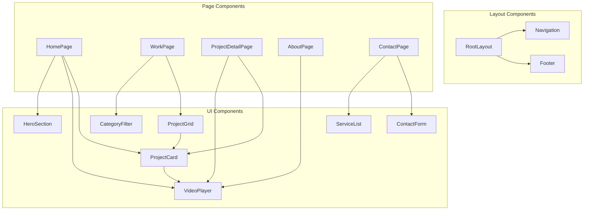

# Components

## VideoPlayer Component

**Responsibility:** Reusable video player with lazy loading, autoplay support, and optimization features

**Key Interfaces:**
- `src: string` - Video source URL
- `poster?: string` - Poster image URL
- `autoplay?: boolean` - Enable autoplay (muted)
- `loop?: boolean` - Enable looping
- `onPlay?: () => void` - Play callback
- `onError?: (error: Error) => void` - Error callback

**Dependencies:** None (vanilla React)

**Technology Stack:** React component with HTML5 video API, Intersection Observer for lazy loading

---

## ProjectCard Component

**Responsibility:** Displays project thumbnail with hover preview and navigation to detail page

**Key Interfaces:**
- `project: Project` - Project data
- `priority?: boolean` - Image loading priority
- `showPreview?: boolean` - Enable hover video preview

**Dependencies:** VideoPlayer (for hover preview), Next.js Link, Next.js Image

**Technology Stack:** React component with CSS transitions for hover effects

---

## ContactForm Component

**Responsibility:** Handles contact form UI, validation, and submission

**Key Interfaces:**
- `onSuccess?: () => void` - Success callback
- `onError?: (error: string) => void` - Error callback

**Dependencies:** Contact API service

**Technology Stack:** React Hook Form (optional) or controlled components, fetch API

---

## Navigation Component

**Responsibility:** Site header with navigation links and mobile menu

**Key Interfaces:**
- N/A (uses Next.js routing internally)

**Dependencies:** Next.js Link, usePathname hook

**Technology Stack:** React component with useState for mobile menu toggle

---

## Footer Component

**Responsibility:** Site footer with social links and copyright

**Key Interfaces:**
- `socialLinks: SocialLink[]` - Social media links

**Dependencies:** None

**Technology Stack:** React component

---

## Component Diagrams

---
