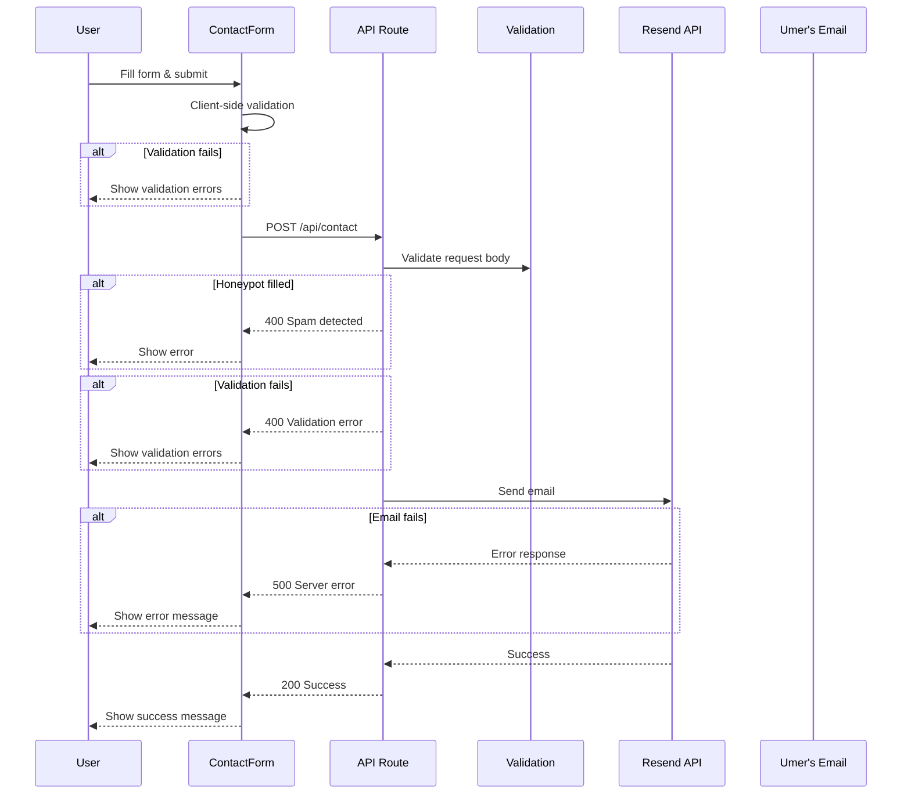
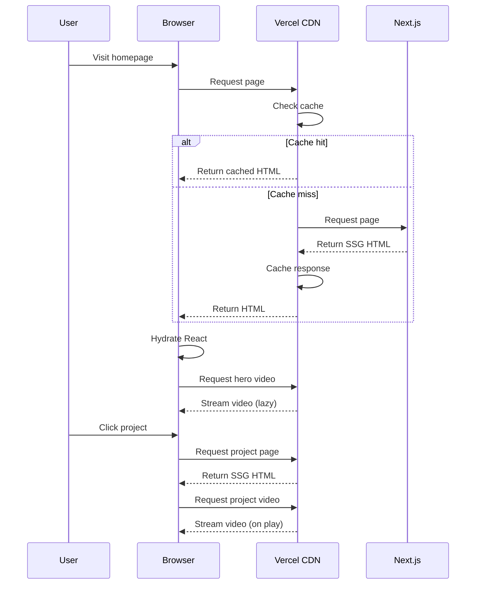

# Core Workflows

## Contact Form Submission Flow

```mermaid
sequenceDiagram
    participant U as User
    participant F as ContactForm
    participant A as API Route
    participant V as Validation
    participant R as Resend API
    participant E as Umer's Email

    U->>F: Fill form & submit
    F->>F: Client-side validation
    alt Validation fails
        F-->>U: Show validation errors
    end
    F->>A: POST /api/contact
    A->>V: Validate request body
    alt Honeypot filled
        A-->>F: 400 Spam detected
        F-->>U: Show error
    end
    alt Validation fails
        A-->>F: 400 Validation error
        F-->>U: Show validation errors
    end
    A->>R: Send email
    alt Email fails
        R-->>A: Error response
        A-->>F: 500 Server error
        F-->>U: Show error message
    end
    R-->>A: Success
    A-->>F: 200 Success
    F-->>U: Show success message
```

## Portfolio Browsing Flow

```mermaid
sequenceDiagram
    participant U as User
    participant B as Browser
    participant V as Vercel CDN
    participant N as Next.js

    U->>B: Visit homepage
    B->>V: Request page
    V->>V: Check cache
    alt Cache hit
        V-->>B: Return cached HTML
    else Cache miss
        V->>N: Request page
        N-->>V: Return SSG HTML
        V->>V: Cache response
        V-->>B: Return HTML
    end
    B->>B: Hydrate React
    B->>V: Request hero video
    V-->>B: Stream video (lazy)
    U->>B: Click project
    B->>V: Request project page
    V-->>B: Return SSG HTML
    B->>V: Request project video
    V-->>B: Stream video (on play)
```

---
