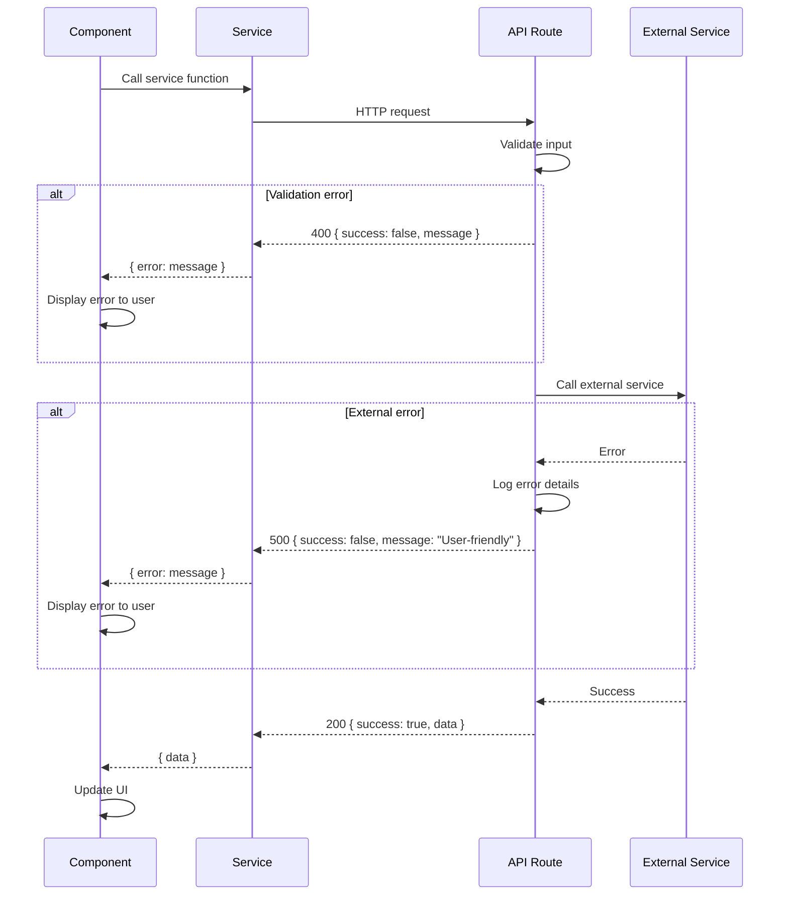

# Error Handling Strategy

## Error Flow



## Error Response Format

```typescript
// Consistent API error response format

interface ApiResponse<T = unknown> {
  success: boolean;
  message: string;
  data?: T;
  error?: string;
}

// Example error responses:
// 400: { success: false, message: "Name is required" }
// 500: { success: false, message: "Failed to send message. Please try again." }
// 200: { success: true, message: "Message sent successfully" }
```

## Frontend Error Handling

```typescript
// lib/error-handler.ts

export function getErrorMessage(error: unknown): string {
  if (error instanceof Error) {
    return error.message;
  }
  if (typeof error === 'string') {
    return error;
  }
  return 'An unexpected error occurred';
}

// Usage in components
try {
  await submitContactForm(data);
} catch (error) {
  setError(getErrorMessage(error));
}
```

## Backend Error Handling

```typescript
// lib/api-error.ts

export class ApiError extends Error {
  constructor(
    message: string,
    public statusCode: number = 500,
    public details?: unknown
  ) {
    super(message);
    this.name = 'ApiError';
  }
}

// Usage in API routes
export async function POST(request: NextRequest) {
  try {
    // ... handle request
  } catch (error) {
    console.error('API Error:', error);

    if (error instanceof ApiError) {
      return NextResponse.json(
        { success: false, message: error.message },
        { status: error.statusCode }
      );
    }

    return NextResponse.json(
      { success: false, message: 'An unexpected error occurred' },
      { status: 500 }
    );
  }
}
```

---
