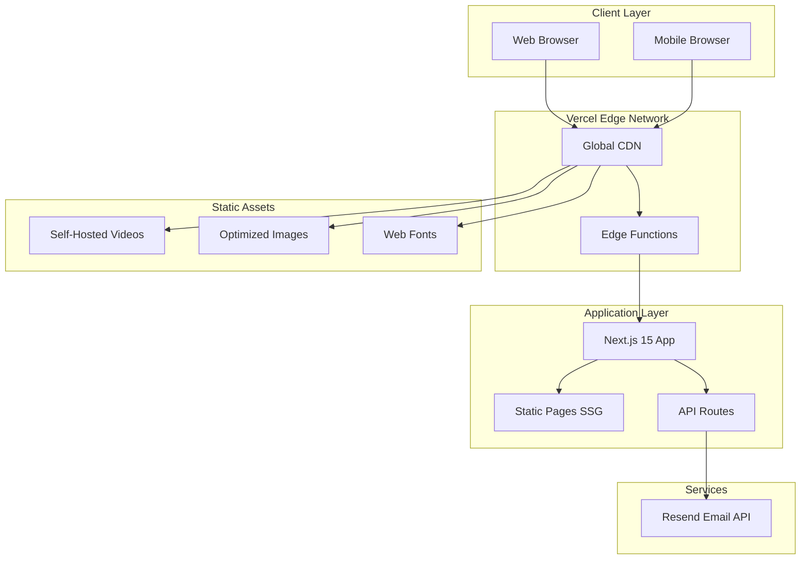

# High Level Architecture

## Technical Summary

UmerFilms is a JAMstack portfolio application built with Next.js 15 using the App Router for optimal performance and SEO. The architecture leverages static site generation (SSG) for all portfolio pages, with a single serverless API route handling contact form submissions via Resend email service. Self-hosted videos are served through Vercel's Edge Network with lazy loading and progressive enhancement. The entire application deploys as a single unit to Vercel, providing automatic CI/CD, edge caching, and global CDN distribution. This architecture achieves the PRD goals of sub-3-second load times, video-first experience, and seamless client inquiry capture.

## Platform and Infrastructure Choice

**Platform:** Vercel

**Key Services:**
- Vercel Edge Network (CDN, static hosting)
- Vercel Serverless Functions (API routes)
- Vercel Analytics (performance monitoring)
- Resend (transactional email)

**Deployment Region:** Auto (Vercel's global edge network)

**Rationale:**
- Vercel is purpose-built for Next.js - zero configuration deployment
- Edge Network provides optimal video delivery performance
- Serverless functions handle contact form without managing servers
- Free tier covers MVP requirements
- Built-in analytics for tracking Core Web Vitals

## Repository Structure

**Structure:** Monorepo (single Next.js application)

**Monorepo Tool:** N/A - Single app, npm workspaces not needed for MVP

**Package Organization:** Standard Next.js App Router structure

**Rationale:**
- Portfolio is a single application with no separate services
- Keeps deployment simple - one repo, one deploy
- Shared types/utilities live within the app structure

## High Level Architecture Diagram

## Architectural Patterns

- **JAMstack Architecture:** Pre-rendered static pages with serverless API for dynamic functionality - _Rationale:_ Maximum performance for portfolio browsing, minimal infrastructure costs, excellent SEO

- **Component-Based UI:** Reusable React components with TypeScript - _Rationale:_ Maintainability, type safety, consistent design system across pages

- **Static Site Generation (SSG):** All pages pre-rendered at build time - _Rationale:_ Fastest possible page loads, optimal Core Web Vitals, CDN-cacheable

- **Serverless Functions:** API routes for contact form processing - _Rationale:_ No server management, scales to zero when unused, cost-effective

- **Progressive Enhancement:** Core content accessible without JavaScript, enhanced with interactivity - _Rationale:_ SEO benefits, accessibility, faster perceived performance

- **Service Layer Pattern:** Centralized API communication through service modules - _Rationale:_ Separation of concerns, easier testing, consistent error handling

---
